# mwcapture

A Direct Show filter that can capture audio and video from a [Magewell Pro Capture HDMI 4k Plus](https://www.magewell.com/products/pro-capture-hdmi-4k-plus) card using the [MWCapture SDK](https://www.magewell.com/sdk) with support for multichannel audio and HDR.

Depends on LAVAudio being present in the graph to handle audio processing.

Supports 

* Linear PCM and non linear PCM audio formats
* SDR and HDR video formats
* automatic reaction to audio codec changes or video format changes

There are no end user configuration options available as the filter is designed to capture the input as is and pass it downstream.

Note that such live updates to audio and video formats rely on the downstream filters (renderers, audio output) to accept dynamic format changes. Such behaviour is supported by both JRiver and mpc-hc.

## Installation

* Download the latest release from https://github.com/3ll3d00d/mwcapture/releases & unzip to some directory
* Open an admin cmd prompt in that directory
* If using the trace-release or warn-release package, rename `mwcapture.ax` to `mwcapture-trace.ax` or `mwcapture-warn.ax`
* Register the filter using `regsvr32`, e.g. `regsvr32 mwcapture.ax`

### Tested On

* Windows 10 and Windows 11
* [J River JRVR](https://wiki.jriver.com/index.php/JRVR_-_JRiver_Video_Renderer) in [MC33](https://yabb.jriver.com/interact/index.php/board,84.0.html)
* mpc-hc with [madvr b113 or below only](http://madshi.net/madVRhdrMeasure113.zip) or mpc-vr

## Configuration

It's recommended to also configure the filter provided by Magewell as it provides an easy way to see information about incoming signal as well as allowing for management of the EDID presented by the card. 

See the [official installation guide](https://www.magewell.com/files/ProCapture-User-Manual.pdf) for details.

### JRiver Media Center

Refer to the JRiver wiki for supporting information

* [features](https://wiki.jriver.com/index.php/Television)
* [setup guide](https://wiki.jriver.com/index.php/TV_Setup)
* [JRVR setup](https://wiki.jriver.com/index.php/JRVR_-_JRiver_Video_Renderer)

First, check the device is available in MC (Media Center)

* Go to Windows Device Manager > Sound, video and game controllers
* Check the magewell device is visible and take note of the name (00 Pro Capture HDMI 4k+ in this example)

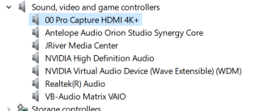

* Install mwcapture as per the installation steps above
* Open MC
* Go to Television > TV Options > Manage Devices, there should be at least 2 devices visible
    * the magewell device filter
    * mwcapture filter (aka `Magewell Pro Capture`)
    * if the release-trace or release-warn filters are installed, they will also be visible in the list  

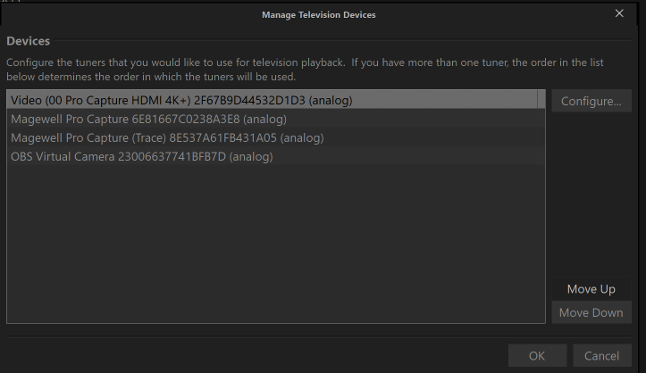

Next, make each filter available as a channel

* go to Television > TV Options > Manage Channels
* click `Add Channel` for each listed device using the following values
    * Type = Camera
    * Name = free text of your choice
    * Device = the magewell filter or the mwcapture filter

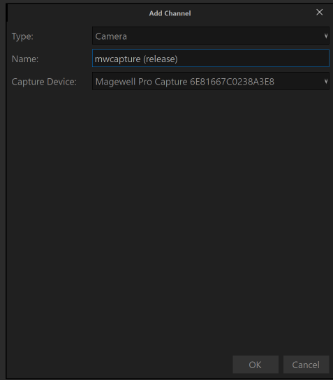

To play using the filter, just start playback of the specified channel & configure JRVR as required

## Logging

The release-trace, release-warn and debug-trace filters write information to a log file which can be found at`%TEMP%\magewell_capture_YYYYMMDD_HHMMSS.log`.

The -warn filter produces warnings only whereas the -trace filters can produce some very large log files (particularly the debug-trace version).

## Investigating Issues

Most issues require an understanding of what signal is presented to the filter. There are 2 common ways to achieve this.

### Magewell Property Pages

> :warning: These are only available when using the magewell filter, they are **NOT** available using mwcapture

Pages 15 & 19-23 of the [official installation guide](https://www.magewell.com/files/ProCapture-User-Manual.pdf) provide full detail of the information provided.

To access the property pages in MC

* start playback using the Magewell filter
* right click on the displayed picture
* navigate to the video filter via DirectShow filters and left click 

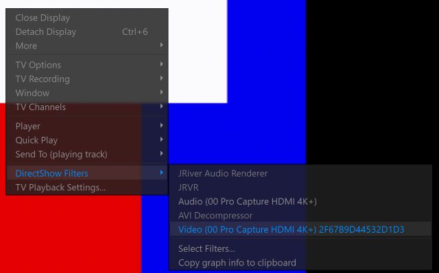

#### SDR 

HDMI InfoFrame

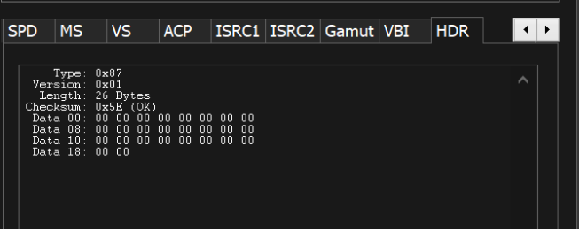

Video Signal

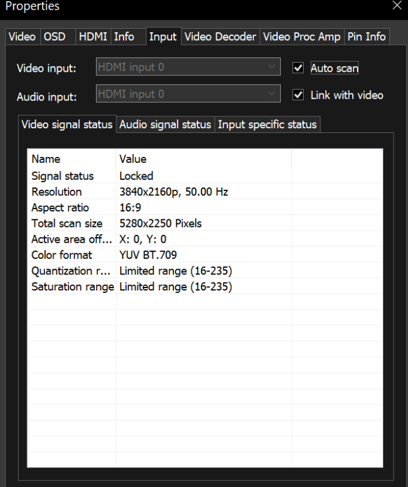

Input Signal

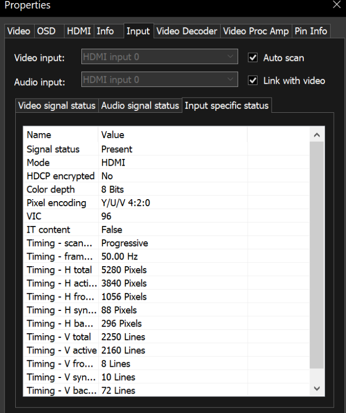

results in the following JRVR OSD

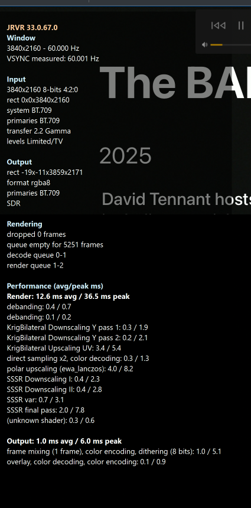

#### HDR 

HDMI InfoFrame

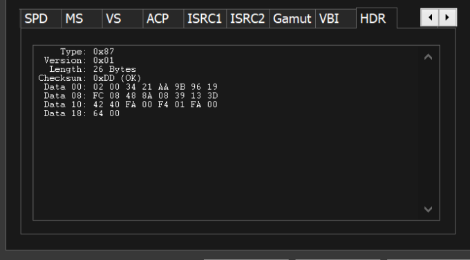

Video Signal

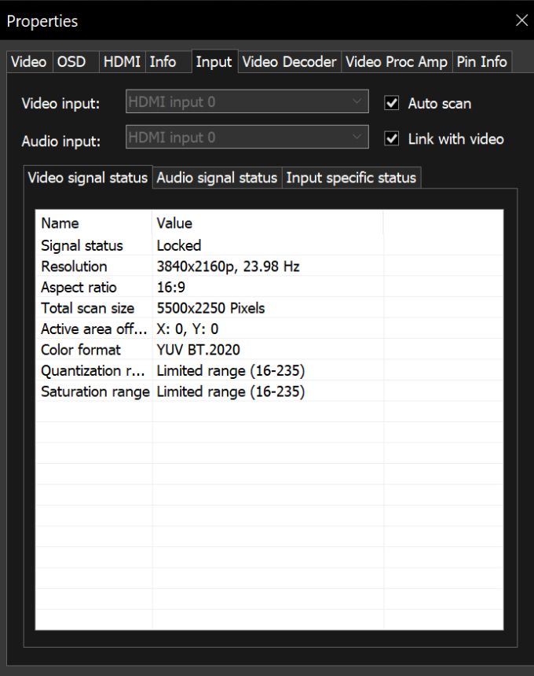

Input Signal

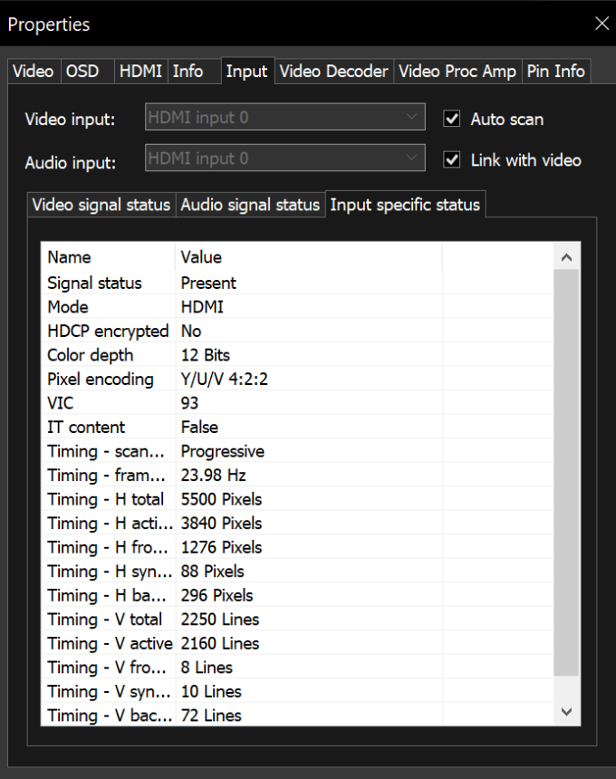

results in the following JRVR OSD

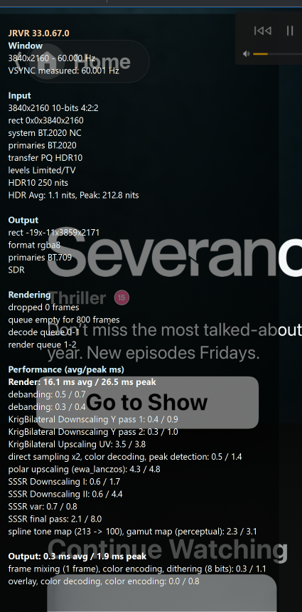

### mwcapture logs

> :warning: These logs are generated when using mwcapture, they are **NOT** available using the magewell filter

Start playback using the release-trace filter and examine the log file, sample log sections for different events are shown below

#### No Signal is present

```
21:12:50.220481729 [73016] mwcapture.cpp:1714           LOG_ERROR     filter       [Capture] LoadSignal MWGetInputSpecificStatus is invalid, will display no/unsupported signal image
21:12:50.220482030 [73016] mwcapture.cpp:1855           LOG_TRACE_L2  filter       [Capture] Signal is not locked (0)
21:12:51.221469518 [73016] mwcapture.cpp:1985           LOG_TRACE_L1  filter       [Capture] Timeout and no signal, get delivery buffer for no signal image
21:12:51.221476351 [73016] mwcapture.cpp:1022           LOG_TRACE_L2  filter       [Capture] Pinning 1036800 bytes
21:12:51.222431616 [73016] mwcapture.cpp:1169           LOG_TRACE_L1  filter       [Capture] Captured video frame 5 at 50095228
21:12:51.222433790 [73016] mwcapture.cpp:1034           LOG_TRACE_L2  filter       [Capture] Unpinning 1036800 bytes, captured 1036800 bytes
```

#### Video Format Changed Successfully

```
21:12:54.070131375 [73016] mwcapture.cpp:1930           LOG_TRACE_L1  filter       [Capture] Video signal change, retry after backoff
21:12:54.090818848 [73016] mwcapture.cpp:1608           LOG_INFO      filter       [Capture] Video dimension change 720x480 to 3840x2160
21:12:54.090819479 [73016] mwcapture.cpp:1643           LOG_INFO      filter       [Capture] Video pixel encoding change 0 to 3
21:12:54.090819729 [73016] mwcapture.cpp:1651           LOG_INFO      filter       [Capture] Video colour format change RGB to YUV709
21:12:54.090819829 [73016] mwcapture.cpp:1662           LOG_INFO      filter       [Capture] Video colorimetry change quant 1 to 2 sat 1 to 2
21:12:54.090819890 [73016] mwcapture.cpp:1880           LOG_WARNING   filter       [Capture] VideoFormat changed! Attempting to reconnect
21:12:54.090822354 [73016] mwcapture.cpp:1771           LOG_WARNING   filter       [Capture] Proposing new video format 3840 x 2160 (16:9) @ 50 Hz in 8 bits (NV12 YUV709 tf: 4) size 12441600 bytes
21:12:54.091619232 [73016] mwcapture.cpp:827            LOG_TRACE_L1  filter       [Capture] MagewellCapturePin::RenegotiateMediaType ReceiveConnection accepted
21:12:54.091619873 [73016] mwcapture.cpp:939            LOG_TRACE_L1  filter       [Capture] MagewellCapturePin::NegotiateMediaType succeeded
```

#### Video Format Change Not Accepted

```
21:13:30.627445449 [73016] mwcapture.cpp:1930           LOG_TRACE_L1  filter       [Capture] Video signal change, retry after backoff
21:13:30.648093202 [73016] mwcapture.cpp:1608           LOG_INFO      filter       [Capture] Video dimension change 720x480 to 3840x2160
21:13:30.648093973 [73016] mwcapture.cpp:1625           LOG_INFO      filter       [Capture] Video FPS change 50 to 23
21:13:30.648094134 [73016] mwcapture.cpp:1643           LOG_INFO      filter       [Capture] Video pixel encoding change 0 to 1
21:13:30.648094184 [73016] mwcapture.cpp:1651           LOG_INFO      filter       [Capture] Video colour format change RGB to YUV709
21:13:30.648094444 [73016] mwcapture.cpp:1662           LOG_INFO      filter       [Capture] Video colorimetry change quant 1 to 2 sat 1 to 2
21:13:30.648094504 [73016] mwcapture.cpp:1880           LOG_WARNING   filter       [Capture] VideoFormat changed! Attempting to reconnect
21:13:30.648096989 [73016] mwcapture.cpp:1771           LOG_WARNING   filter       [Capture] Proposing new video format 3840 x 2160 (16:9) @ 23 Hz in 8 bits (NV16 YUV709 tf: 4) size 16588800 bytes
21:13:30.648102439 [73016] mwcapture.cpp:933            LOG_WARNING   filter       [Capture] MagewellCapturePin::NegotiateMediaType Receive Connection failed (hr: -0x7ffbfdd6); QueryAccept: 0x000001
21:13:30.648102620 [73016] mwcapture.cpp:948            LOG_TRACE_L1  filter       [Capture] MagewellCapturePin::NegotiateMediaType failed -0x7ffbfde7
21:13:30.648103862 [73016] mwcapture.cpp:1891           LOG_ERROR     filter       [Capture] VideoFormat changed but not able to reconnect! retry after backoff [Result: -0x7ffbfde7]
```

#### Video Format Changes to HDR

```
21:13:30.753099802 [73016] mwcapture.cpp:1495           LOG_INFO      filter       [Capture] HDR metadata is now present
21:13:30.753100754 [73016] mwcapture.cpp:1503           LOG_INFO      filter       [Capture] Primaries RGB 34000 x 16000 13250 x 34500 7500 x 3000
21:13:30.753101064 [73016] mwcapture.cpp:1508           LOG_INFO      filter       [Capture] Whitepoint 15635 x 16450
21:13:30.753101325 [73016] mwcapture.cpp:1513           LOG_INFO      filter       [Capture] DML/MaxCLL/MaxFALL 50 / 1000 854 289
21:13:30.753101495 [73016] mwcapture.cpp:1608           LOG_INFO      filter       [Capture] Video dimension change 720x480 to 3840x2160
21:13:30.753101605 [73016] mwcapture.cpp:1625           LOG_INFO      filter       [Capture] Video FPS change 50 to 23
21:13:30.753101666 [73016] mwcapture.cpp:1633           LOG_INFO      filter       [Capture] Video bit depth change 8 to 12
21:13:30.753101726 [73016] mwcapture.cpp:1643           LOG_INFO      filter       [Capture] Video pixel encoding change 0 to 1
21:13:30.753101786 [73016] mwcapture.cpp:1651           LOG_INFO      filter       [Capture] Video colour format change RGB to YUV2020
21:13:30.753101936 [73016] mwcapture.cpp:1662           LOG_INFO      filter       [Capture] Video colorimetry change quant 1 to 2 sat 1 to 2
21:13:30.753102036 [73016] mwcapture.cpp:1674           LOG_INFO      filter       [Capture] Video transfer function change REC.709 (4) to SMPTE ST 2084 (PQ) (15)
21:13:30.753102477 [73016] mwcapture.cpp:1880           LOG_WARNING   filter       [Capture] VideoFormat changed! Attempting to reconnect
21:13:30.753103769 [73016] mwcapture.cpp:1771           LOG_WARNING   filter       [Capture] Proposing new video format 3840 x 2160 (16:9) @ 23 Hz in 12 bits (P210 YUV2020 tf: 15) size 33177600 bytes
21:13:30.753841967 [73016] mwcapture.cpp:827            LOG_TRACE_L1  filter       [Capture] MagewellCapturePin::RenegotiateMediaType ReceiveConnection accepted
21:13:30.753842658 [73016] mwcapture.cpp:939            LOG_TRACE_L1  filter       [Capture] MagewellCapturePin::NegotiateMediaType succeeded
```

#### HDR Metadata is sent downstream

```
21:13:30.878061562 [73016] mwcapture.cpp:1189           LOG_TRACE_L1  filter       [Capture] Updating HDR meta in frame 1659, last update at 0
21:13:30.878095650 [73016] mwcapture.cpp:1233           LOG_TRACE_L1  filter       [Capture] HDR meta: R 0.6800 0.3200
21:13:30.878096000 [73016] mwcapture.cpp:1235           LOG_TRACE_L1  filter       [Capture] HDR meta: G 0.2650 0.6900
21:13:30.878096010 [73016] mwcapture.cpp:1237           LOG_TRACE_L1  filter       [Capture] HDR meta: B 0.1500 0.0600
21:13:30.878096020 [73016] mwcapture.cpp:1239           LOG_TRACE_L1  filter       [Capture] HDR meta: W 0.3127 0.3290
21:13:30.878096091 [73016] mwcapture.cpp:1241           LOG_TRACE_L1  filter       [Capture] HDR meta: DML 0.005 1000
21:13:30.878096111 [73016] mwcapture.cpp:1243           LOG_TRACE_L1  filter       [Capture] HDR meta: MaxCLL/MaxFALL 854 289
```

#### Audio Format changed successfully

```
21:13:31.525123574 [73824] mwcapture.cpp:3447           LOG_INFO      filter       [AudioCapture] Input channel count change 2 to 8
21:13:31.525123754 [73824] mwcapture.cpp:3456           LOG_INFO      filter       [AudioCapture] Output channel count change 2 to 8
21:13:31.525124435 [73824] mwcapture.cpp:3473           LOG_INFO      filter       [AudioCapture] Fs change 44100 to 48000
21:13:31.525124646 [73824] mwcapture.cpp:3489           LOG_INFO      filter       [AudioCapture] Channel allocation change 0 to 19
21:13:31.525124706 [73824] mwcapture.cpp:4144           LOG_WARNING   filter       [AudioCapture] AudioFormat changed! Attempting to reconnect
21:13:31.525128954 [73824] mwcapture.cpp:3799           LOG_WARNING   filter       [AudioCapture] Proposing new audio format Fs: 48000 Bits: 16 Channels: 8 Codec: PCM
21:13:31.525136428 [73824] mwcapture.cpp:865            LOG_TRACE_L1  filter       [AudioCapture] MagewellCapturePin::NegotiateMediaType QueryAccept accepted
21:13:31.525169249 [73824] mwcapture.cpp:896            LOG_TRACE_L1  filter       [AudioCapture] Updated allocator to 3072 bytes 16 buffers
21:13:31.525169320 [73824] mwcapture.cpp:939            LOG_TRACE_L1  filter       [AudioCapture] MagewellCapturePin::NegotiateMediaType succeeded
```

#### Successful change to non linear PCM

```
21:22:28.277013911 [75400] mwcapture.cpp:4035           LOG_TRACE_L2  filter       [AudioCapture] Reading frame 204
21:22:28.277014543 [75400] mwcapture.cpp:4054           LOG_TRACE_L2  filter       [AudioCapture] Bitstream probe in frame 204 - PCM 48000 Hz (since: 0 len: 19 burst: 0)
21:22:28.280307731 [75400] mwcapture.cpp:4035           LOG_TRACE_L2  filter       [AudioCapture] Reading frame 205
21:22:28.280309193 [75400] mwcapture.cpp:4054           LOG_TRACE_L2  filter       [AudioCapture] Bitstream probe in frame 205 - PCM 48000 Hz (since: 1 len: 19 burst: 0)
21:22:28.284296155 [75400] mwcapture.cpp:4035           LOG_TRACE_L2  filter       [AudioCapture] Reading frame 206
21:22:28.284296866 [75400] mwcapture.cpp:4054           LOG_TRACE_L2  filter       [AudioCapture] Bitstream probe in frame 206 - PCM 48000 Hz (since: 2 len: 19 burst: 0)
21:22:28.288258032 [75400] mwcapture.cpp:4035           LOG_TRACE_L2  filter       [AudioCapture] Reading frame 207
21:22:28.288258282 [75400] mwcapture.cpp:4054           LOG_TRACE_L2  filter       [AudioCapture] Bitstream probe in frame 207 - PCM 48000 Hz (since: 3 len: 19 burst: 0)
21:22:28.292278975 [75400] mwcapture.cpp:4035           LOG_TRACE_L2  filter       [AudioCapture] Reading frame 208
21:22:28.292279836 [75400] mwcapture.cpp:4054           LOG_TRACE_L2  filter       [AudioCapture] Bitstream probe in frame 208 - PCM 48000 Hz (since: 4 len: 19 burst: 0)
21:22:28.296255313 [75400] mwcapture.cpp:4035           LOG_TRACE_L2  filter       [AudioCapture] Reading frame 209
21:22:28.296255994 [75400] mwcapture.cpp:4054           LOG_TRACE_L2  filter       [AudioCapture] Bitstream probe in frame 209 - PCM 48000 Hz (since: 5 len: 19 burst: 0)
21:22:28.300323724 [75400] mwcapture.cpp:4035           LOG_TRACE_L2  filter       [AudioCapture] Reading frame 210
21:22:28.300324075 [75400] mwcapture.cpp:4054           LOG_TRACE_L2  filter       [AudioCapture] Bitstream probe in frame 210 - PCM 48000 Hz (since: 6 len: 19 burst: 0)
21:22:28.300325968 [75400] mwcapture.cpp:4280           LOG_TRACE_L2  filter       [AudioCapture] Found PaPb at position 652-656 (5263 since last)
21:22:28.300326660 [75400] mwcapture.cpp:4364           LOG_TRACE_L2  filter       [AudioCapture] Found codec AC3 with burst size 1536
21:22:28.300327311 [75400] mwcapture.cpp:4065           LOG_TRACE_L2  filter       [AudioCapture] Detected bitstream in frame 210 PCM (res: 0x000002)
21:22:28.304325313 [75400] mwcapture.cpp:4035           LOG_TRACE_L2  filter       [AudioCapture] Reading frame 211
21:22:28.304329501 [75400] mwcapture.cpp:4065           LOG_TRACE_L2  filter       [AudioCapture] Detected bitstream in frame 211 AC3 (res: 0x000002)
21:22:28.308317378 [75400] mwcapture.cpp:4035           LOG_TRACE_L2  filter       [AudioCapture] Reading frame 212
21:22:28.308320273 [75400] mwcapture.cpp:4065           LOG_TRACE_L2  filter       [AudioCapture] Detected bitstream in frame 212 AC3 (res: 0x000000)
21:22:28.308320604 [75400] mwcapture.cpp:3481           LOG_INFO      filter       [AudioCapture] Codec change PCM to AC3
21:22:28.308320864 [75400] mwcapture.cpp:4144           LOG_WARNING   filter       [AudioCapture] AudioFormat changed! Attempting to reconnect
21:22:28.308325413 [75400] mwcapture.cpp:3799           LOG_WARNING   filter       [AudioCapture] Proposing new audio format Fs: 48000 Bits: 16 Channels: 2 Codec: AC3
21:22:28.308331594 [75400] mwcapture.cpp:865            LOG_TRACE_L1  filter       [AudioCapture] MagewellCapturePin::NegotiateMediaType QueryAccept accepted
21:22:28.308363234 [75400] mwcapture.cpp:896            LOG_TRACE_L1  filter       [AudioCapture] Updated allocator to 1536 bytes 16 buffers
21:22:28.308363645 [75400] mwcapture.cpp:939            LOG_TRACE_L1  filter       [AudioCapture] MagewellCapturePin::NegotiateMediaType succeeded
```

## Debugging

Requires 

1. installation of the [Magewell SDK](https://www.magewell.com/downloads#capture-sdk-dark-anchor) 
2. the debug-trace filter
3. an understanding of how to debug a DirectShow filter 

